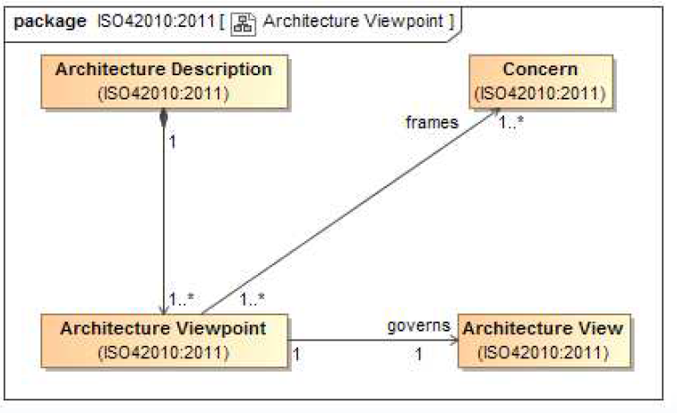

# ISO-42010

## What is ISO 42010 for ?

ISO 42010 addresses the creation, analysis and sustainment of architectures of systems through the use of semantically rigorous architecture descriptions.

## Who made it ?

- ISO/IEC/IEEE 42010 was prepared by Joint Technical Committee ISO/IEC JTC 1, Information technology, Subcommittee SC 7, Software and systems engineering
- In cooperation with the Software and Systems Engineering Standards Committee of the Computer Society of the IEEE
- And IEC (the International Electrotechnical Commission)

## In short

- A core ontology for the description of architectures
  - 19 terms
  - Definitions of those terms
  - Relationships between the terms
- Conformance requirements
  - 24 high level "shalls"
- Best practices on the documentation of architectures

## Systems and Environments

**Systems** exist. A system is situated in its **Environment**. That **environment** could include other **Systems**.

The Standard takes no position on the question, *What is a system ?*
**Systems** can be man-made, natural or conceptual.
It could refer to :

- Enterprise
- System of systems
- Product line
- Service
- Subsystem
- Software

Nothing in the Standard depends upon a particular definition of system.

## Environment

A system is situated in an **environment**. The **environment** determines the totality of influences upon the system throughout its life cycle, including its interaction with that **environment**.
The **environment** of a system is bounded by and understood through the identification and analysis of the system's **stakeholders** and theirs **concerns**.

## Stakeholders and Concerns

**Stakeholders** have interests in a **System of Interest;** those interests are called **Concerns**.

### Stakeholder

**Stakeholders** are individuals, groups or organizations holding **Concerns** for the **System of Interest**. Examples of stakeholders : client, owner, user, consumer, supplier, designer, maintainer, auditor, CEO, certification authority, architect.

### Concern

A **Concern** is an interest in the system by one or more stakeholders.
A **Concern** pertains to any influence of a system in its environment :

- Developmental
- Technological
- Business
- Operational
- Organizational
- Political
- Economic
- Legal
- Regulatory
- Ecological
- Social

## Architectures and Architecture Description

**Systems** have **Architectures**. An **Architecture Description** is used to express an **Architecture** of a **System of Interest**.

### Architecture

An **architecture** is an abstraction of a system. Fundamental concepts or properties of a system in its environment embodied in its elements, relationships and in the principles of its design and evolution.
A system has an architecture even if that architecture is not written down. There are no requirements in the Standard pertaining to architectures, to systems or to their environments.

## Architecture description Context

**Architectural Descriptions** should address relevant **stakeholder** **concerns** about the **system of interest**.

### Architecture description

An **Architecture description** (AD) is a work product that expresses an **Architecture** for a **System ofInterrest**. **Stakeholders** use **Architecture Descriptions** to understand, analyze and compare (System) **Architectures**. An **AD** ma take the form of document(s), model(s), simulation(s) or other forms.
An architecture description results form the execution of architecting activities within the life cycle of the **System of Interest**.

AD can document essential aspects of a system :

- Inteded use and environment
- Principles, assumptions and constraints on structure and behavior
- Points of flexibility or limitations of the system
- Architecture decisions, their **rationales** and **impacts**.

Possibles uses of architecture descriptions :

- Analyse and evaluate existing system performance
  - planning, scheduling and budgeting activites
  - training and policy about the system
  - system interaction processes
  - system maintenance activities
- Review, analysis, and evaluation of the system acress its life cycle
  - Analyse and evaluate alternative implementations of an architecture
  - System design activities
  - System manufacturing activities

## Architecture description Content

**Architecture Descriptions** are comprised of **Architecture Views** of **AD elements**. (Any item in a AD is considered an AD Element) Stakeholder concerns are addressed when an **AD** exposes **AD Elements** an **Architecture Views** that satisfies the conventions established by an **Architecture Viewpoint**.

### AD Requirements

An **AD** shall :

- Identify the **System of Interest**.
- Identify the system **Stakeholders** having **Concerns** considered fundamental to the **Architecture** of the **System of Interest**.
- Identify the **Concerns** considered fundamental to the **Architecture** of the **System of Interest**.
- Associate each identified **concern** with the identified **stakeholders** having that **concern**.

## Architecture View

An **Architecture View** exposes a limited set of **[AD Elements](Architecture_Description_Element.md)** and **[Relationships](Correspondence.md)**. An **Architecture View** **addresses** one or more of the **[Concerns](Concern.md)** held by the [System of Interest's](System_of_Interest.md) [Stakeholders](Stakeholder.md) *(When it conforms to an [Architectural Viewpoint](Architecture_Viewpoint.md))*.
An [Architecture Description](Architecture_Description.md) includes one or more **Architecture Views**.

## Architecture Viewpoint

An **architecture viewpoint** frames a specific set of [Concerns](Concern.md).
An [architecture view](Architecture_Viewpoint.md) is governed by its **viewpoint**.

An **Architecture viewpoint** :

- Is a way of looking at a [system of interest](System_of_Interest.md).
- Is a set of conventions for constructing, interpreting, using and analyzing [Architecture Views](Architecture_View.md).
- Scopes these conventions to frame a specific set of [Concerns](Concern.md).
- Codify application-specific, method-specific, or organization-specific approaches to capture, organize and share [system of interest](System_of_Interest.md) knowledge.

Reuirement : Each [concern](Concern.md) identified shall be framed by at least one **viewpoint**.
An [AD](Architecture_Description.md) shall include excactly one [Architecture view](Architecture_View.md) for each **Architecture viewpoint** used.

## Architecture Description Elements

**AD Elements** are the most primitive constructs of an [architectural description](Architecture_Description.md).
An **AD element** is any construct in an [Architecture Description](Architecture_Description.md). By specializing **AD elements** to other information items, a project and/or organization could express all required [relations](Correspondence.md) of [architectural interest](Architecture_interest.md).
Every [Stakeholder](Stakeholder.md), [concern](Concern.md), [architecture viewpoint](Architecture_Viewpoint.md), [architecture view](Architecture_View.md), [system](System.md) [environment](Environment.md) and [architecture description](Architecture_Description.md) is considered and **AD Element**.

**AD elements** and their [relationships](Correspondence.md) are exposed in [Architectural Views](Architecture_View.md) in attempt to address [Stakeholder](Stakeholder.md) [Concerns](Concern.md).

## Value Add of Architecture viewpoints

By identifying the [System of Interest](System_of_Interest.md), the [Stakeholders](Stakeholder.md), their [concerns](Concern.md), and their **Viewpoints** you have started to scope out what information is required to be conveyed about the [system](System.md) [architecture](Architecture.md).

- This scopes the work (time, money, schedule) required to gather and organize that information.
- Lots of work is wasted on information gathering and organizing activities that are never even requested.

## Architecture Element Correspondence

A **Correspondence** defines a relation between [AD elements](Architecture_Description_Element.md).
**Correspondences** can be governed by a **[correspondence rules](Correspondence_rules.md)**.
**Correspondences** and [correspondence rules](Correspondence_rules.md) may be used to express, record, enforce and analyze consistency between [views](Architecture_View.md) and [AD elements](Architecture_Description_Element.md) within an [AD](Architecture_Description.md).

Correspondences are used to express [architecture](Architecture.md) relations of [interest](Architecture_interest.md) within an [architecture description](Architecture_Description.md).

Examples :

- Composition
- Refinement
- Consistency
- Traceability
- Dependecy
- Constraint
- Obligation

[AD Elements](Architecture_Description_Element.md) in a **correspondence** need not be distinct. A **correspondence** can be defined between an [AD element](Architecture_Description_Element.md) and itself.
Requirement : Each correspondence in an [AD](Architecture_Description.md) shall be identified and identify its participating [AD elements](Architecture_Description_Element.md).