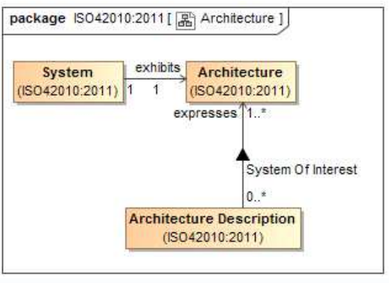

# Architecture

An **architecture** is an abstraction of a [system](System.md). Fundamental concepts or properties of a [system](System.md) in its [environment](Environment.md) embodied in its [elements](Architecture_Description_Element.md), [relationships](Correspondence.md) and in the principles of its design and evolution.
A [system](System.md) has an **architecture** even if that **architecture** is not written down. There are no requirements in the Standard pertaining to architectures, to [systems](System.md) or to their [environments](Environment.md).
