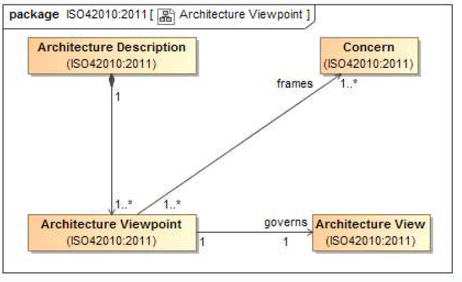

# Architecture Viewpoint

An **architecture viewpoint** frames a specific set of [Concerns](Concern.md).
An [architecture view](Architecture_View.md) is governed by its **viewpoint**.

An **Architecture viewpoint** :

- Is a way of looking at a [system of interest](System_of_Interest.md).
- Is a set of conventions for constructing, interpreting, using and analyzing [Architecture Views](Architecture_View.md).
- Scopes these conventions to frame a specific set of [Concerns](Concern.md).
- Codify application-specific, method-specific, or organization-specific approaches to capture, organize and share [system of interest](System_of_Interest.md) knowledge.

Reuirement : Each [concern](Concern.md) identified shall be framed by at least one **viewpoint**.
An [AD](Architecture_Description.md) shall include excactly one [Architecture view](Architecture_View.md) for each **Architecture viewpoint** used.

## Value of Architecture viewpoints

By identifying the [System of Interest](System_of_Interest.md), the [Stakeholders](Stakeholder.md), their [concerns](Concern.md), and their **Viewpoints** you have started to scope out what information is required to be conveyed about the [system](System.md) [architecture](Architecture.md).

- This scopes the work (time, money, schedule) required to gather and organize that information.
- Lots of work is wasted on information gathering and organizing activities that are never even requested.
