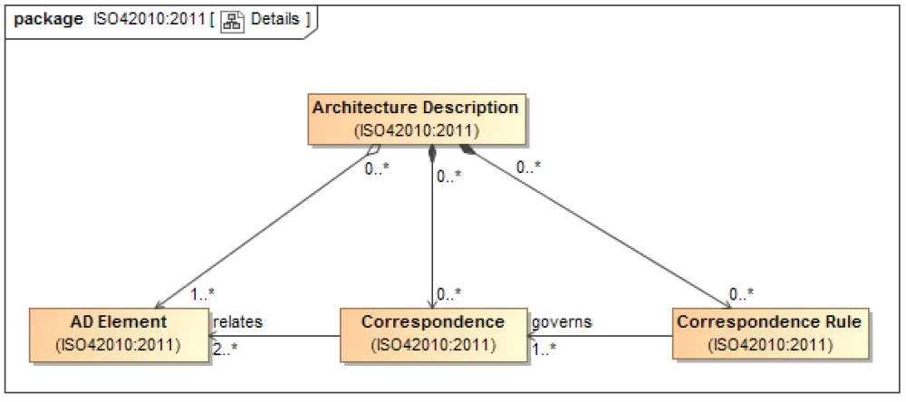

# Architecture Element Correspondence

A **Correspondence** defines a relation between [AD elements](Architecture_Description_Element.md).
**Correspondences** can be governed by a **[correspondence rules](Correspondence_rules.md)**.
**Correspondences** and [correspondence rules](Correspondence_rules.md) may be used to express, record, enforce and analyze consistency between [views](Architecture_View.md) and [AD elements](Architecture_Description_Element.md) within an [AD](Architecture_Description.md).

Correspondences are used to express [architecture](Architecture.md) relations of [interest](Architecture_interest.md) within an [architecture description](Architecture_Description.md).

Examples :

- Composition
- Refinement
- Consistency
- Traceability
- Dependecy
- Constraint
- Obligation

[AD Elements](Architecture_Description_Element.md) in a **correspondence** need not be distinct. A **correspondence** can be defined between an [AD element](Architecture_Description_Element.md) and itself.

> [!WARNING] Requirements
> Each correspondence in an [AD](Architecture_Description.md) shall be identified and identify its participating [AD elements](Architecture_Description_Element.md).
