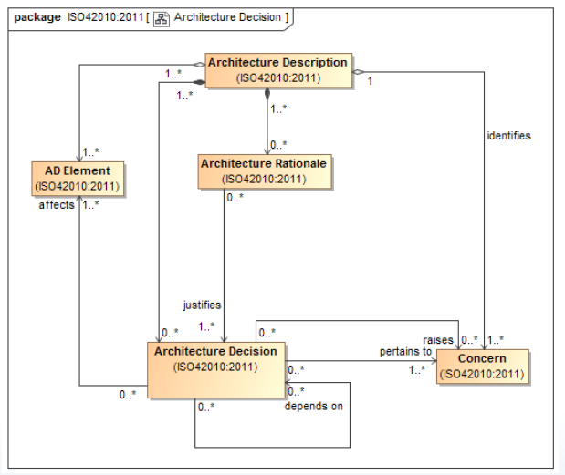

# Decision

Architecture decisions pertain to [Stakeholder](Stakeholder.md) [concerns](Concern.md).
An Architecture decision can affect the [architecture](Architecture.md) in several ways :

- Requiring the existence of [AD Element](Architecture_Description_Element.md).
- Changing [AD elements](Architecture_Description_Element.md) and their [correspondences](Correspondence.md).
- Removal or obsolescence of [AD elements](Architecture_Description_Element.md).

An Architecture decision can raise additional [Stakeholder](Stakeholder.md) [Concerns](Concern.md).

> [!WARNING] Requirements
> An [AD](Architecture_Description.md) should record architecture decision considered to be key to the [architecture](Architecture.md) of the [system of interest](System_of_Interest.md). *(It is not practical to record every architecture decision about a [system](System.md).)*

It can be useful to record relationship dependencies between architecture decision :

- Constrains
- Influences
- Enables
- Triggers
- Forces
- Subsumes
- Refines
- Conflicts-with
- Is-compatile-with
