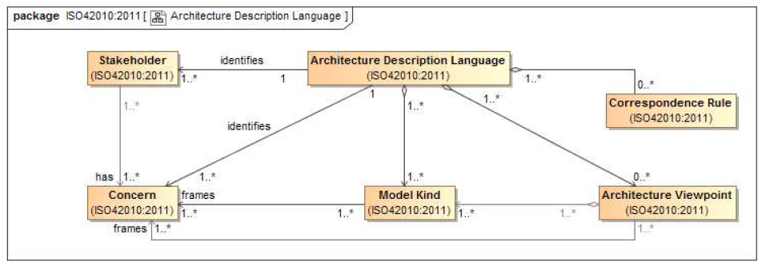

# Architecture Description Language

An **architecture description language (ADL)** is any language for use in an [architecture description](Architecture_Description.md). Therefore an ADL can be used by one or more [viewpoints](Architecture_Viewpoint.md) to frame identified [systems](System.md) [concerns](Concern.md) within an [architecture description](Architecture_Description.md).

Like an [architecture framework](Frameworks.md), an **ADL** frames a specific set of [concerns](Concern.md) for an audience of [stakeholders](Stakeholder.md), defining one or more [model kinds](Model_Kind.md) together with any associated analysis methods or tools.

Similar to an [architecture framework](Frameworks.md) or [architecture viewpoint](Architecture_Viewpoint.md), an **ADL** is a reusable resource, it is not limited in use to an individual [system](System.md) or [architecture description](Architecture_Description.md).

Often an ADL is supported by automated tools to aid the creation, use and analysis of its [models](Model.md).

>[!IMPORTANT] Requirements
>
>- Identification of one or more [concerns](Concern.md).
>- Identification of one or more [stakeholders](Stakeholder.md) having those [concerns](Concern.md).
>- [Model kinds](Model_Kind.md) implemented by the **ADL** which frame those [concerns](Concern.md)

An ADL should include :

- [Correspondance rules](Correspondence_rules.md)
- [Architecture viewpoints](Architecture_Viewpoint.md)

An ADL need not provide any [architecture viewpoints](Architecture_Viewpoint.md), it can define one or more [model kinds](Model_Kind.md) for use in [architecture viewpoints](Architecture_Viewpoint.md) defined elsewhere.

>[!TIP] ADLs examples
>
>- MOF (Meta-modelling language)
>   - UML
>     - SysML
>     - UAF
>   - BPMN
>- Archimate
>- IDEF
>- OSLC
>- MS Office
