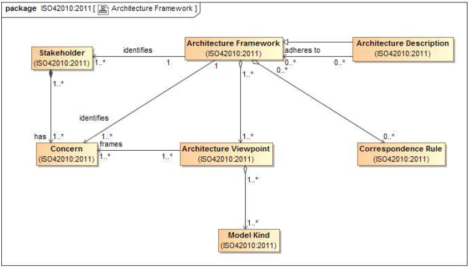

# Framework

An architecture framework establishes a common practice for all creating, interpreting, analyzing and using architecture descriptions within a particular domain of application or stakeholder community.

Uses of architecture frameworks include, but are not limited to :

- Creating architecture descriptions
- Developing architecture modelling tools and architecting methods
- Establishing processes to facilitate communication, commmitments and interoperation across multiple projects and/or organizations.

> [!IMPORTANT] Requirements
>
>- Identification of one or more concerns
>- Identification of one or more stakeholders having those concerns
>- One or more architecture viewpoints that frame those concerns

An **architecture framework** should include :

- [Correspondence rules](Correspondence.md)
- Conditions of applicability

**Architecture frameworks** often include additional content, prescriptions and relationship not defined by the Standard :

- process requirement
- Life cycle connections
- Documentation formats

Since [ADs](Architecture_Description.md) are [Architecture Models](Model.md), this means that ISO 42010 is an **Architecture Framework** since it contains the necessary and sufficient information required by the Standard.

>[!CAUTION] Requirements
> An [architecture description](Architecture_Description.md) adheres to an architecture framwork when :
>
>- Each *applicable* [stakeholder](Stakeholder.md) identified in the **framework** has been considered and identified in the [AD](Architecture_Description.md).
>- Each *applicable* [concern](Concern.md) identified in the **framework** has been considered and identified in the [AD](Architecture_Description.md).
>- Each *applicable* [viewpoint](Architecture_Viewpoint.md) specified by the **framework** has beed included in the [AD](Architecture_Description.md).
>- Each *applicable* [correspondence rule](Correspondence_rules.md) specified by the **framework** is included in the [AD](Architecture_Description.md).

An [Architecture description](Architecture_Description.md) could adhere to one or more frameworks, or to no frameworks.

For an [architecture description](Architecture_Description.md) to adhere to more than one framework would entail a reconciliation between each framework's identified [stakeholders](Stakeholder.md), [concerns](Concern.md), [viewpoints](Architecture_Viewpoint.md), [model kinds](Model_Kind.md), and [correspondence rules](Correspondence_rules.md) within the [architecture description](Architecture_Description.md).

>[!TIP] Architecture Frameworks examples
>
>- DoDAF (does not require a specific [ADL](Description_Language.md))
>- TOGAF
>- Zachman
>- UAF
>- ISO/IEC/IEEE 15289
>- DoD 5000.02 Operation of the Defense Acquisition System
