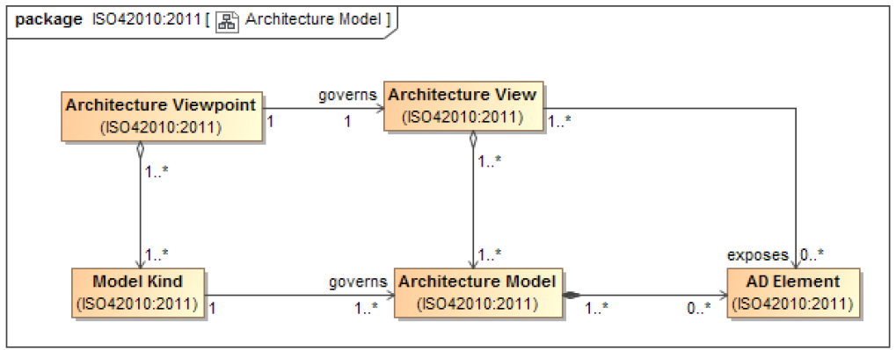

# Architecture Models

An [architecture view](Architecture_View.md) is created through an aggregation of one or more **architecture models**. An **architecture model** uses modelling conventions approriate to the [concerns](Concern.md) to be addressed. These conventions are specified by the [model kind](Model_Kind.md) governing that model.

An architecture model contains the [AD elements](Architecture_Description_Element.md).
Sharing **architecture models** between [architecture views](Architecture_View.md) permits an [AD](Architecture_Description.md) to frame distinct but related [concerns](Concern.md) without redundancy or repetition, and reduces possibilities for inconsistency.
The standard does not prescribe how **architecture models** are created. They can be individually constructed, derived from or based upon other models.

> [!WARNING] Requirements
>Each **architecture models** shall be identified by a governing [model kind](Model_Kind.md), and adhere to the conventions of that [model kind](Model_Kind.md).

Models and modelling underlie much of systems architecture. The motion of *model* is central to understanding ISO 42010. Different communities use model in different ways.

Its important to udernstand the term model as used in the Standard.
> *M* is a model of *S* if *M* can be used to answer questions about *S*.

This statement has two important consequences :

1. Every model has a subject
2. A model can be anything

    1. A model can be concept (a "mental model")
    2. A model can be a work product.

## Architecture model related to generic model

Architecture models and *architecting* are specialized forms of *models* and *modeling*.
A model is an **Architecture Model** if it contains model elements that can be used as [AD elements](Architecture_Description_Element.md). *(i.e. as part of [architecture views](Architecture_View.md) in conformance with [architecture viewpoints](Architecture_Viewpoint.md).)*

In fact, an [architecture description](Architecture_Description.md) is itself an **architecture model**. It contains [AD elements](Architecture_Description_Element.md) necessary for addressing [System](System.md) [Stakeholder](System.md) [concerns](Concern.md).
