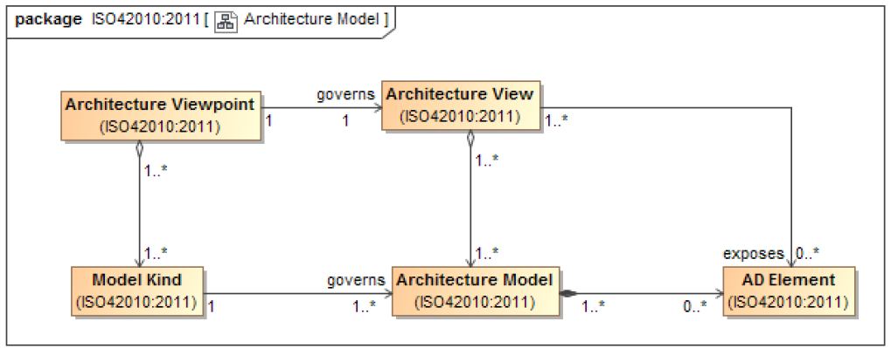

# Model kind

The conventions governing a model are specified by its **Model Kind**.

> [!IMPORTANT] Requirements
> An [architectural viewpoint](Architecture_Viewpoint.md) shall specify the **model kinds** that govern the [architectural models](Model.md) used to develop the [architectural view](Architecture_View.md) that the [architectual viewpoint](Architecture_Viewpoint.md) governs.

A model kinds specifies :

- Languages
- Notations
- Conventions
- Modelling
- Techniques
- Analytical methods and/or other operations

The standard uses the term model kind rather than *"architecture model kind"* to emphasize that model kinds need not be useful exclusively in [ADs](Architecture_Description.md).

