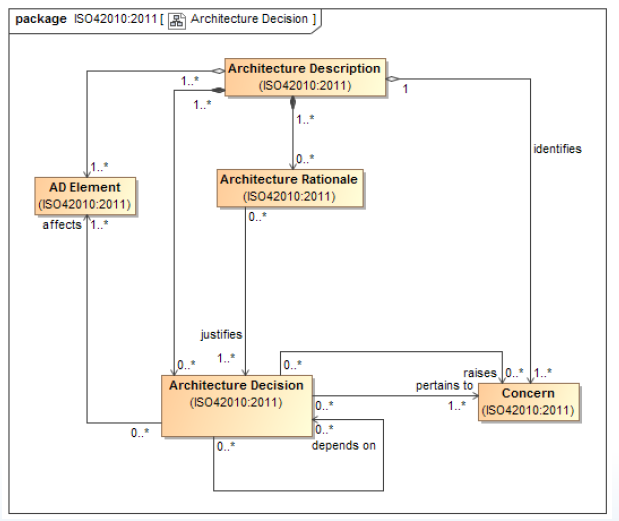

# Rationale

Architecture **Rationale** records explanation, justification or reasoning about architecture [decisions](Decision.md) that have been made.

The Architecture Rationale for an [Architecture Decision](Decision.md) can include :

- The basis for a decission
- Alternatives and trade-offs considered
- Potential consequences of the decision
- citations to sources of additional information

> [!WARNING] Requirements
> An [AD](Architecture_Description.md) shall include a rationale for each [Architecture viewpoint](Architecture_Viewpoint.md), [Stakeholders](Stakeholder.md), [Concerns](Concern.md).
>
> An [AD](Architecture_Description.md) shall include rationale for each [Architecture Decision](Decision.md).
